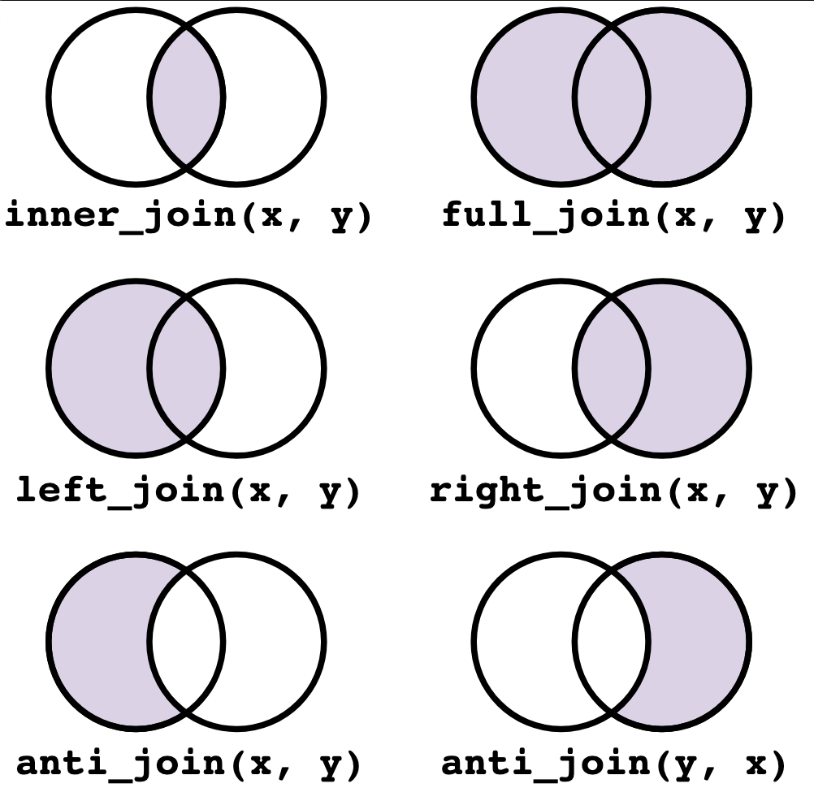

# Introduction to Joins with `dplyr`

In data science, **joins** are essential for combining datasets based on shared information. In biology, joins help integrate different datasets, such as joining protein data with additional annotations or scores.

## Basic Joins:

  - Left Join: Keeps all rows from the first (left) dataset and adds matching rows from the second (right) dataset. If a match is not found, NA values are added for columns from the second dataset.
  
  - Right Join: Keeps all rows from the second (right) dataset and adds matching rows from the first (left) dataset. Rows in the right dataset with no matches in the left dataset are still included, with NA values for columns from the left.

  - Inner Join: Keeps only rows that have matching values in both datasets. Rows with no match in either dataset are excluded.

  - Full Join: Retains all rows from both datasets. If a match is not found, NA values are added for columns from the other dataset.
  
  - Anti Join: Returns only the rows from the first dataset that do not have a match in the second dataset. This allows you to find entries unique to one dataset.

## Other Joins:

  - Semi Join: Filters the first dataset to include only rows with matching keys in the second dataset, but without adding any columns from the second dataset.
  
  - Cross Join: Generates a Cartesian product, combining each row from the first dataset with every row from the second. Cross joins are used sparingly due to the large size of the output.

  - Nest Join: Creates a nested dataframe where each row in the first dataset is paired with all related rows from the second dataset, creating a list-column with the nested data.



We’ll explore the basic join types using `proteins` and `mitocarta` datasets, focusing on practical, biologically relevant questions.

# Getting Started

Install and load the required packages:

```{r setup, include = FALSE}
# install.packages("tidyverse")
library(tidyverse)
```

Run the code below to load the `proteins` and `mitocarta` datasets:

```{r}
# install.packages("remotes")
# remotes::install_github("tidybiology/tidybiology", force = TRUE)
# remotes::install_github("matthewhirschey/mitocarta", force = TRUE)
library(tidybiology)
library(mitocarta)

data(proteins)
data(mitocarta)

# Keep relevant columns only
proteins <- proteins %>% 
  dplyr::select(gene_name, sequence)

mitocarta <- mitocarta %>% 
  dplyr::select(symbol, mito_domain_score) %>% 
  tidyr::drop_na(mito_domain_score)
```

# Exercises

## Exercise 1: Identifying Join Keys

Learn to identify which columns from two datasets can be used to join them, a fundamental step in performing joins.

Inspect the `proteins` and `mitocarta` datasets to find the columns they have in common. Specifically, identify columns that contain the same type of information, as they’ll be used for joining.

```{r}
# Inspect the datasets to identify join columns
glimpse(proteins)
glimpse(mitocarta)

# Observations: Use `gene_name` from `proteins` and `symbol` from `mitocarta` as join keys
```

## Exercise 2

Combine `proteins` and `mitocarta` retaining all rows from `proteins`. This is useful when you want to keep all information from a primary dataset while adding additional data where available.

Combine `proteins` and `mitocarta` so that all rows from `proteins` are retained. Save the result as a new dataframe called `proteins_mito`.

```{r}
proteins_mito <- proteins %>%
  dplyr::left_join(mitocarta, by = c("gene_name" = "symbol"))
```

## Exercise 3: Counting Missing Values

Learn to count missing values in the resulting dataframe. This step is essential in evaluating the success of a join and identifying gaps in the data.

Count the number of missing values in the `mito_domain_score` column of `proteins_mito`.

```{r}
# Count missing values in mito_domain_score
proteins_mito %>%
  dplyr::filter(is.na(mito_domain_score)) %>%
  dplyr::count()
```

## Exercise 4

Combine `proteins` and `mitocarta` retaining all rows from `mitocarta`. This approach is helpful when you want all annotations from `mitocarta` that may not appear in `proteins`.

Combine `proteins` and `mitocarta` so that only rows with `mito_domain_score` values are included in the resulting dataframe. Save the result as `mito_proteins`.

```{r}
mito_proteins <- proteins %>%
  dplyr::right_join(mitocarta, by = c("gene_name" = "symbol"))
```

## Exercise 5

Combine `proteins` and `mitocarta` retaining only common rows from both datasets. This technique is useful when you need complete data for all columns, excluding rows with missing values.

Combine `proteins` and `mitocarta` ensuring no NA values remain in the resulting dataframe. Confirm there are no missing values.

```{r}
# Inner join to keep only rows with matches in both datasets
complete_proteins <- proteins %>%
  dplyr::inner_join(mitocarta, by = c("gene_name" = "symbol"))

# Confirm no missing values
no_missing_values <- complete_proteins %>%
  drop_na()

nrow(complete_proteins) == nrow(no_missing_values) # TRUE if no missing values
```

# Resources for Further Learning

[R for Data Science: Joins](https://r4ds.hadley.nz/joins.html)

[Tidyverse: dplyr 1.1.0: Joins](https://www.tidyverse.org/blog/2023/01/dplyr-1-1-0-joins/)

  