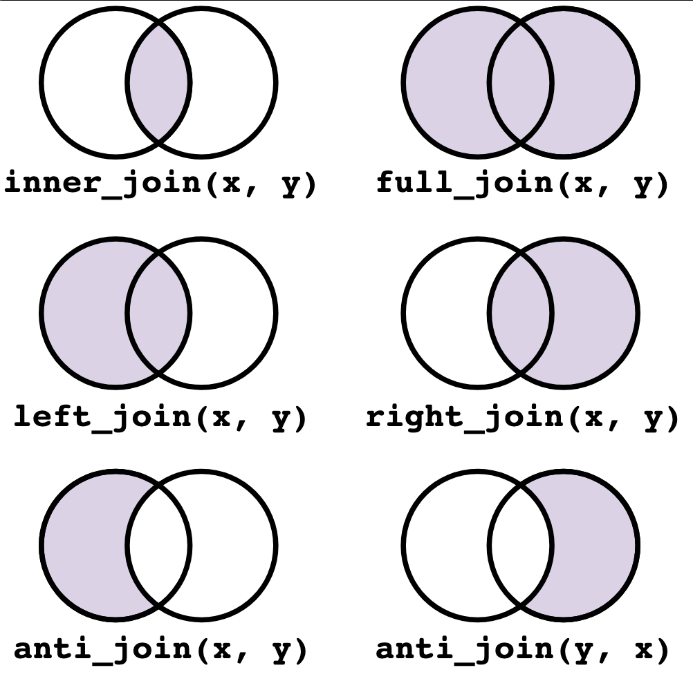

# Introduction to Joins with `dplyr`

In data science, **joins** are essential for combining datasets based on shared information. In biology, joins help integrate different datasets, such as joining protein data with additional annotations or scores.

## Basic Joind:

  - Left Join: Keeps all rows from the first (left) dataset and adds matching rows from the second (right) dataset. If a match is not found, NA values are added for columns from the second dataset.
  
  - Right Join: Keeps all rows from the second (right) dataset and adds matching rows from the first (left) dataset. Rows in the right dataset with no matches in the left dataset are still included, with NA values for columns from the left.

  - Inner Join: Keeps only rows that have matching values in both datasets. Rows with no match in either dataset are excluded.

  - Full Join: Retains all rows from both datasets. If a match is not found, NA values are added for columns from the other dataset.
  
  - Anti Join: Returns only the rows from the first dataset that do not have a match in the second dataset. This allows you to find entries unique to one dataset.

## Other Joins:

  - Semi Join: Filters the first dataset to include only rows with matching keys in the second dataset, but without adding any columns from the second dataset.
  
  - Cross Join: Generates a Cartesian product, combining each row from the first dataset with every row from the second. Cross joins are used sparingly due to the large size of the output.

  - Nest Join: Creates a nested dataframe where each row in the first dataset is paired with all related rows from the second dataset, creating a list-column with the nested data.



We’ll explore the basic join types using `proteins` and `mitocarta` datasets, focusing on practical, biologically relevant questions.

# Getting Started

Install and load the required packages:

```{r setup, include = FALSE}
# install.packages("tidyverse")
library(tidyverse)
```

Run the code below to load the `proteins` and `mitocarta` datasets:

```{r}
# install.packages("remotes")
# remotes::install_github("tidybiology/tidybiology", force = TRUE)
# remotes::install_github("matthewhirschey/mitocarta", force = TRUE)
library(tidybiology)
library(mitocarta)

data(proteins)
data(mitocarta)

# Keep relevant columns only
proteins <- proteins %>% 
  dplyr::select(gene_name, sequence)

mitocarta <- mitocarta %>% 
  dplyr::select(symbol, mito_domain_score) %>% 
  tidyr::drop_na(mito_domain_score)
```

# Exercises

